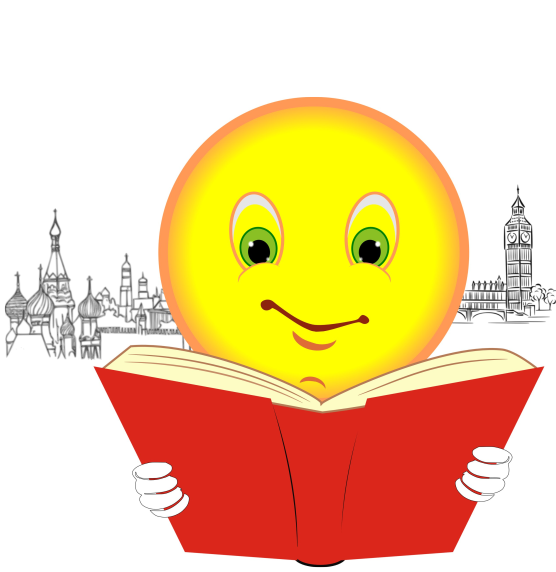

# Введение в Erlang 2-е издание. Simon St. Laurent
## Introducing Erlang 2nd Edition translation into Russian. Simon St. Laurent

The material is a translation of the English edition. The link below is the English version of the book which can be found at: 

[https://learning.oreilly.com/library/view/introducing-erlang-2nd/9781491973363/](https://learning.oreilly.com/library/view/introducing-erlang-2nd/9781491973363/)

## ACKNOWLEDGEMENT:
The translation was made possible thanks to kind permission of O'Reilly Media

## БЛАГОДАРНОСТЬ: 
Выражаю искреннюю признательность издательству O'Reilly Media, которое предоставило мне право на перевод этой книги на русский язык.

[Введение в Erlang. 2е издание](Introducing-Erlang-2nd.-Translation-to-Russian.pdf)

[Code samples from Introducing Erlang, second edition](https://github.com/simonstl/introducing-erlang-2nd)
